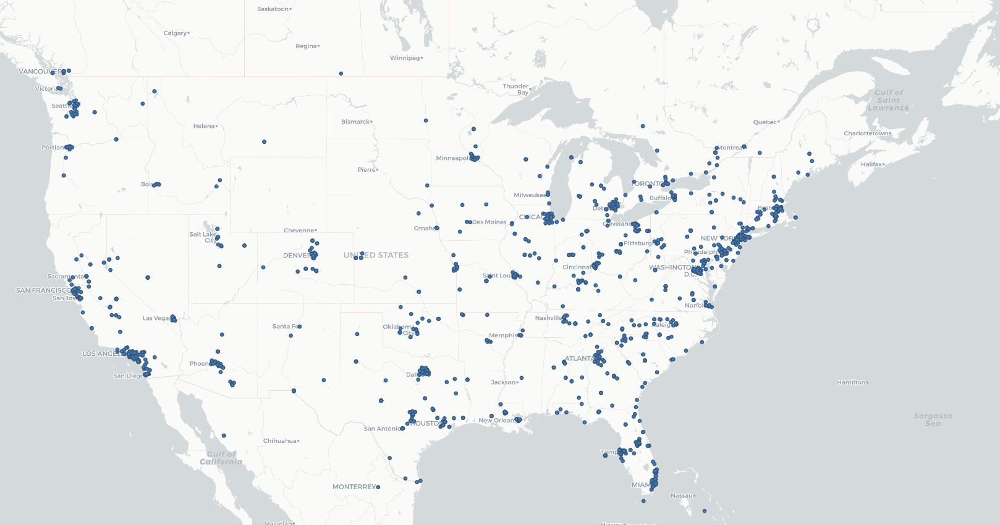
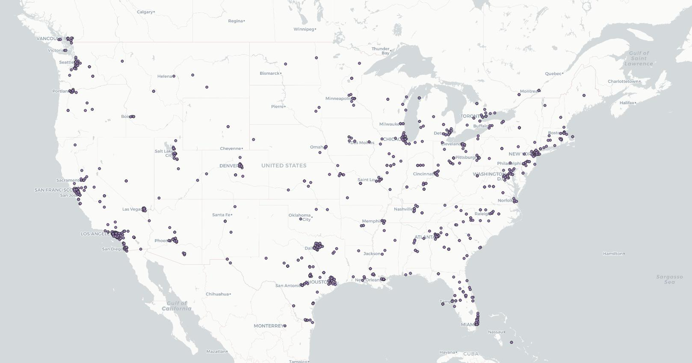
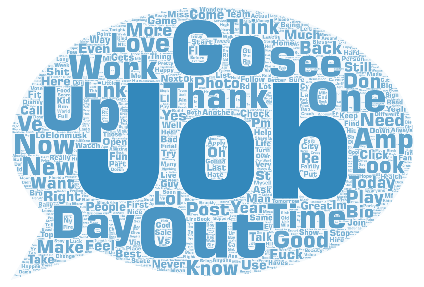
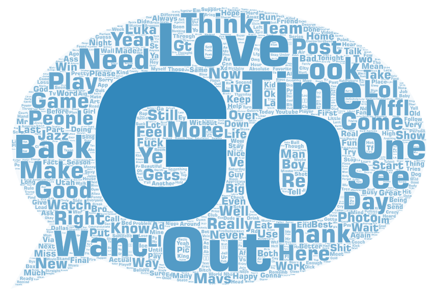

# GEOG458-Lab2

**1.**  The comparison that I wanted to create for this project within my maps and wordclouds was that comparing how people in the US used Twitter at different times of the day. I wanted to see the differences at the content people tweeted during work hours compared to what they tweet while they're off, either at home, or elsewhere. In addition to this, I also wanted to see if I could visualize any large geospatial movement, for example, people dispersing from large city centers after work hours are over. For my data, I collected tweets for 5 minutes once during lunchtime, and once more around 9pm.

**2.** Looking at both of the maps I created with the data collected we can see that they are both very similar. There was unfortunately not very much large geospatial movement to be observed between the two time periods. Most points are clustered in the same general areas. Another observation that can be made is that the east coast of the US in general has a larger population of tweets than the west, which could imply that east coasters use Twitter much more. One more thing to notice is that the of points on the east coast decreases in later time screenshot, which could be a result of the time differences between east and west coast.
 

**3.** For the word clouds, the content matches the context fairly well. For the daytime data, the words mostly emphasized correlate more with things related to work, like "Job" or "Work", while for the nighttime data, the words emphasized correlate more with things related to hobbies, such as "Game" or "Play". Both these word clouds are similar in the way many of the large words are shared, however, there are some words that stand out that allow us to pick out the contextual differences.
 